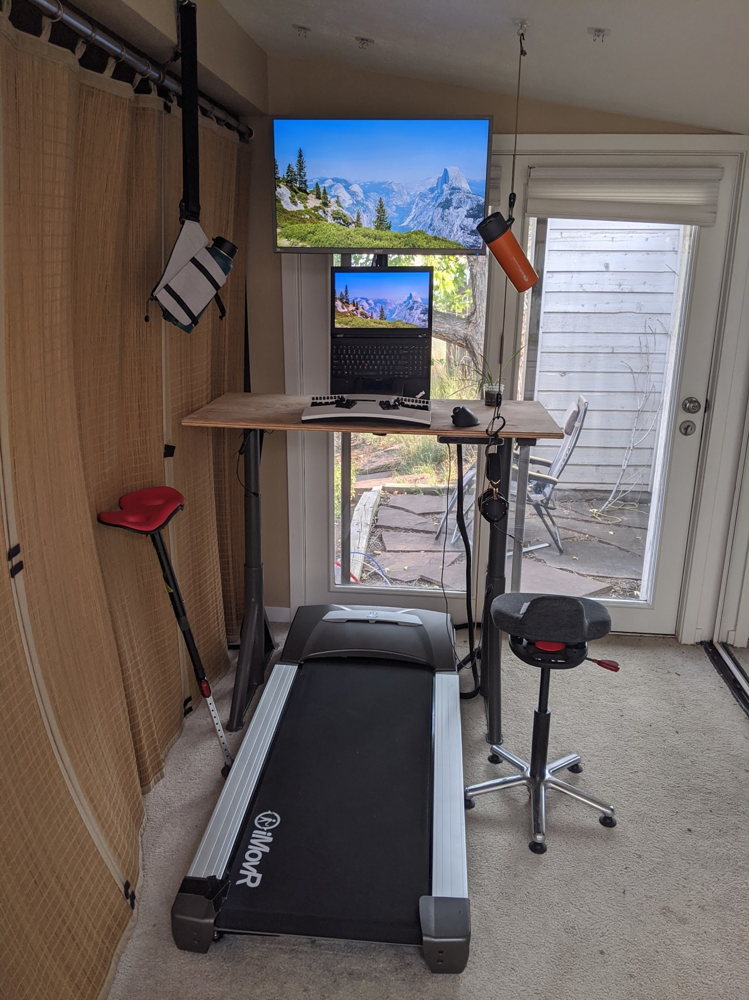

This is a place for me to put miscellaneous updates about my computer
setups, in reverse chronological order. You might also be interested
in [my instagram account for related pictures][instagram].

[instagram]: https://www.instagram.com/treetopian

## 2020-09-12 - standing desk + treadmill!

Quite a lot has changed in the last few months.  I'd have preferred
to do more incremental updates, but instead will just batch the
progress all into one big update.

### Old walking treadmill broke -> new treadmill acquired!

My cheap [GoPlus Treadmill][] broke after only a bit more than a
hundred miles, so I bought a used [IMovr ThermoTread GT][] on
Craigslist, with about 300 miles on it and in pristine
condition. Since it's in such good condition and the summer has
been hot here in Colorado, so far it has lived indoors. I've been
loving it so far[^imovr-reliable], a much less constrained walking
area and much smoother than the cheap treadmill.

[^imovr-reliable]:
  I knew I would love the IMovr, since I also had one in my setup back
  in Washington (as featured in the image at the beginning of the
  ["Outdoor Computing with a Deck Desk" post][]). I actually wanted to
  get a different brand of treadmill, perhaps one from LifeSpan,
  purely for the purpose of comparison. However, there weren't any
  good used options, so I went with the reliably good (though
  expensive!) option of the IMovr.

[GoPlus Treadmill]: https://smile.amazon.com/gp/product/B081JMW6FJ
[IMovR ThermoTread GT]: https://smile.amazon.com/iMovR-ThermoTread-Treadmill-Measures-Standing/dp/B016COFDOA

### New sit-stand desk and active sitting stool

My employer kindly purchased equipment for WFH.  While I contemplated
figuring out some weird ergonomic stuff to get, unfortunately most of
the eccentric options I was interested in, like the [Varier Gravity
Balans][] or the [Humanscale Float desk][] all fell outside the bounds
of both budget and reasonableness.  So, instead, I ended up with the
following setup:

- An electrically actuated sit/stand desk, [Ikea Idasen Sit/Stand
  Underframe][].

    - I chose this desk because it has a reputation for
      being very stable even when fully extended, likely partially due to
      the leg design.  This is particularly important for treadmilling,
      because the desk will be quite high when properly positioned, and
      the action of walking can tend to create little impulses through the
      floor and through your palms, which can cause some wobble.

    - I also read that Linak actuators and electronics are quite nice,
      perhaps superior to the Jiecang actuators found in many popular
      desks (Uplift, Jarvis, Evodesk, Geekdesk, etc).

    - One thing I particularly like about the Linak electronics is
      that it supports bluetooth.  While the phone control is fairly
      lobotimized - it requires you to keep pressing on the phone to
      continue movement - it turns out there is a very handy
      [idasen-controller script][] which allows computer control!  So
      now I can get my desk to move to preset heights via keyboard
      shortcuts.  This makes me disproportionately happy :)

- I got just the underframe, with the intention of putting a very nice
  pice of wood on the top. However, I wanted to have a functioning
  desk quickly after picking up the underframe, and so I got a [$30
  piece of 4'x2' birch plywood from Home Depot][plywood]. My
  woodworking friends tell me the edges could really use some
  improvements, and maybe finishing it would be good, or adding some
  birch edge tape, but I am pretty happy with it for now. I think the
  bare wood looks decent, and since it is was inexpensive I am not as
  concerned about drilling into it, spills, etc.

- [QOR360 "Ariel" active office chair][], which I enjoy a lot so far.
  It forces you to use core stabilization to make sitting a bit more
  active, which prevents slouching.  It *is* possible tilt your pelvis
  all the way back and round your back a bunch in terrible posture, so
  it does not entirely prevent bad posture.  However, that posture is
  so extreme that it immediately feels rediculous and so it is
  impossible for me to linger in it unaware.

- [VIVO desk mount stand][] to raise the screen to a nice height. I
  got a relatively inexpensive stand instead of a fancy adjustable arm
  for the following reasons:

  - The relative height I desire between the keyboard and screen is
    fairly constant between postures, since I am always upright.

  - Most monitor arms can't elevate the center of the screen to 30"
    above the desk surface, but that's where I want it for my
    proportions.

  - When fully elevated, standing desks can be a bit wobbly, and an
    articulated monitor arm can amplify this wobble. To me this is
    mainly a concern when walking on the treadmill, as impulses can
    travel through the floor or through my palms (although, putting
    much pressure through the palms should really be avoided!).

[Varier Gravity Balans]: https://www.varierfurniture.com/en_us/explore-our-chairs/recline/gravity-balans-r
[Humanscale Float desk]: https://www.humanscale.com/products/standing-desks/float-table
[Ikea Idasen Sit/Stand Underframe]: https://www.ikea.com/us/en/p/idasen-sit-stand-underframe-for-table-top-beige-30412165/
[idasen-controller script]: https://github.com/rhyst/idasen-controller
[plywood]: https://www.homedepot.com/p/Birch-Plywood-Common-3-4-in-x-2-ft-x-4-ft-Actual-0-728-in-x-23-75-in-x-47-75-in-154148/203504324
[QOR360 "Ariel" active office chair]: https://qor360.com/shop/the-ariel-active-chair-qor360/
[VIVO desk mount stand]: https://smile.amazon.com/gp/product/B01CUW5HDU

### A variety of postures

This setup supports a variety of postures!

Walking / standing:

Leaning / active sitting:

One very nice thing about the QOR360 chair is that there is an option
to not have caster feet, and the base fits perfectly within the width
of the treadmill belt, so I can put it directly on top.  Similarly,
the [Focal Mogo Stool][] I use for leaning can be used right on top of
the treadmill, so I never need to move the treadmill.

[Focal Mogo Stool]: https://smile.amazon.com/Products-Leaning-Portable-Outdoor-Available/dp/B01I2N71Z8

### Drink suspension

You might have noticed something a little strange going on in this
picture - there's a mug suspended on the right and a water bottle on
the left!  The idea is that if your drink is suspended by a rope,
accidentally bumping it usually never spills it.  It also frees up
some desk space!

On the right, as usual for suspending lightweight things indoors, I am
using [adjustable tie-downs][] with [adhesive hangers][]. The
adjustable part of the tie-down can then hook directly around the loop
built into my [combo coffee mug / french press][]. It's made by GSI
Outdoors, and so is intended for camping and such, but I use it almost
every day.  I like the convenience of just having one thing to clean,
and the built in suspension loop is great for this purpose.

On the left, I am using a [ChicoBag Bottle Sling][].  I particularly
got this because it fits 2 liter bottles, which I use for homemade
seltzer water.  It also nicely fits my [40oz Hydro Flask][].

[ChicoBag Bottle Sling]: https://smile.amazon.com/gp/product/B074RRG8SX
[40oz Hydro Flask]: https://smile.amazon.com/Hydro-Flask-Water-Bottle-Stainless/dp/B083GBLZVG
[combo coffee mug / french press]: https://smile.amazon.com/gp/product/B00UTKKYFW

### Desk cable organization

I put in a silly amount of time organizing the cables.  Here's what it
looked like before:

What a mess! Here are some pics after organizing:

Granted, no longer having the speakers on the desk reduced the number
of cables a bit. The "before" pictures were taken a few months ago, as
it took me a while to get around to putting up this update.

And here are some pics of the underside, in case you were curious:

Here's the stuff involved:

* After looking around at different cable management ideas, I came
  across the idea of using finger ducts, which let you stuff the
  cables in the box, and have them enter / exit at any of the
  slots. Most of them are plastic, though, and I wanted something more
  solid, that screwed into the desk.  Happily, I found some metal [19
  inch 1U server rack finger ducts][] which ended up fitting quite
  nicely for this application.

* [Screw-in cable tie bases][]. Many of the cable tie bases out there
  are adhesive, but I wanted something more solid, so got ones that
  screw in.  I thought I'd use a bunch of these, but I only ended up
  using one, to hold some charging cables.

* [Braided cable sleeve][] to tidy up the monitor cables / power
  cables.

* [Electriduct powerstrip][] provides three plugs and two USB power
  ports.  It's fairly decent, I got it because it can be screwed into
  the bottom of the desk, with the outlets facing horizontally.

* [CalDigit USB-C Pro Dock][], this was a bit of a splurge, but it's
  very well built and works great (and with Linux!). I particularly
  got it because it supports 85W of charging, whereas many hubs limit
  the rate of charge.  I also liked the future-proofing of it being
  thunderbolt, though, admittedly, a plain old USB-C dock would be
  sufficient for my usage.  I used one packet of [Sugru][] to affix it
  to the bottom of the desk.

  

[19 inch 1U server rack finger ducts]: https://smile.amazon.com/gp/product/B07HNMVYD9/
[Braided cable sleeve]: https://smile.amazon.com/gp/product/B07NVG25D1
[Screw-in cable tie bases]: https://smile.amazon.com/gp/product/B01B5RJ0XY
[Electriduct powerstrip]: https://smile.amazon.com/gp/product/B00UNWOM7W
[CalDigit USB-C Pro Dock]: https://smile.amazon.com/CalDigit-USB-C-Pro-Dock-Thunderbolt/dp/B07VL675DT

## 2020-05-25 - suspending keyboard from ceiling!

Today I was doing some standing computing (as described in the
[standing keyboard section of the deskless wfh
post][deskless-standing-keyboard]), when I realized I wanted to be
able to take quick inversion breaks (handstands, headstands).  Doing
these inversions is impeded because I needed to detach my keyboard.
Two solutions occurred to me:

1. Use straps + buckle to allow for quick attachment / detachment.

2. Also suspend the keyboard, so I can just walk up to it and start
   using it. Since the materials for this were readily at hand, I gave
   this option a shot!  It took less than 5 minutes to set this up,
   which is a pretty great turnaround from idea to implementation.

Here's the initial implementation, using the same adjustable tie-downs
and adhesive hooks described in the ["Laptop Ceiling Suspension"
post][]:

Here are some closeups on how it's attached:

The same can be done suspending it from branches / even twigs, just
using the [adjustable tie-downs][]:

Roughly what it looks like in use:

So far I'm liking this a lot!  I think there are still some advantages
over a stationary mount, because the keyboard still has some movement
freedom - I can move side to side / turn a bit.  This movement freedom
is not quite as much as suspension from pants, but there is the
notable benefit that I can immediately walk away from the computer
without having a keyboard attached to me!

## 2020-05-16 - ["Polarizer Glasses" post][]

Synopsis: I built some variable angle polarizer glasses based on
camera optics!

## 2020-05-02 - ["Laptop Ceiling Suspension" post][]

Synopsis: Using adhesive hangers and adjustable tie-downs to suspend
laptops.

## 2020-04-25 - hammock under the deck!

I found a rather nice spot under the deck for my [Dutchware Chameleon
backpacking hammock]:

You might notice that there are some hooks hanging down.  These are
for suspending my laptop screen above my head, for ergonomic supine
computing! These hooks are [adjustable tie-downs][], attached via
[adhesive hangers][]. The nice thing about these adhesive hangers is
that they can be removed without damaging the surface.

So, this is very similar to the approach of suspending from zip-ties /
wire as described in the ["Laptop Ceiling Suspension"
post][]. However, this was relatively unstable because the front of
the body ended up resting on the ridgeline. I discovered that putting
the hooks through the zip ties and hooking to the ridgeline added some
nice stabilization:

I realize it might be hard to visualize how this works.  Perhaps I
will post some pictures of this hammock setup in use at some point.
For now, here's a picture from the ["Tree based Computing" post][]:

[Dutchware Chameleon backpacking hammock]: https://dutchwaregear.com/product-category/hammock-gear/hammocks/chameleon/

## 2020-03-25 - ["Deskless Ergonomic Work-From-Home Setups" post][]

Synopsis: A few different ideas for comfortably working from home,
without a desk.

## 2020-03-25 - ["Tree Based Computing" post][]

Synopsis: A portable and ergonomic way to use your computer in nature.

## 2019-12-18 - ["Supine Computing" post][]

Synopsis: Comfortable computer use while laying down, dealing with
back pain. Hammocks!

## 2019-12-08 - ["Outdoor Computing with a Deck Desk" post][]

Synopsis: Experiments in outdoor computing, deck desking, and reclined
computing.

## 2018-10-01 - ["Computing comfortably at 30,000 feet" post][]

Synopsis: How to use a laptop on an airline flight with decent
ergonomics.

<!-- shared links -->

[adhesive hangers]: https://smile.amazon.com/gp/product/B07P1P6VQ5
[adjustable tie-downs]: https://smile.amazon.com/gp/product/B01COUOCG6
[Sugru]: https://smile.amazon.com/Sugru-Pegamento-moldeable-f%C3%B3rmula-original/dp/B00EU7DBNM

<!-- post links -->

["Tree Based Computing" post]: /posts/tree-based-computing/

["Deskless Ergonomic Work-From-Home Setups" post]: /posts/deskless-ergo-wfh/
[deskless-standing-keyboard]: /posts/deskless-ergo-wfh#deskless-standing-keyboard

["Supine Computing" post]: /posts/supine-computing/

["Outdoor Computing with a Deck Desk" post]: /posts/deck-desk/

["Computing comfortably at 30,000 feet" post]: /posts/comfortable-airplane-computing/

["Laptop Ceiling Suspension" post]: /posts/suspending-laptops/

["Polarizer Glasses" post]: /posts/polarizer-glasses/
