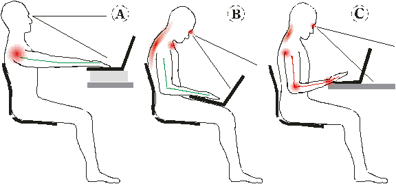

Flying on commercial airlines can often be a bit stressful for both
our minds and bodies.  Flights can also be a nice time to get some
work done, but the ergonomics tends to be pretty awful.  You need to
tilt your head forward, probably slouch your back, while
simultaneously probably putting your wrists at funny angles. So, the
proposed usage embedded in the name "laptop" seems to be inadvisable.

*Image from "The Adaptive Laptop". October, 2001. Timothy Griffin*

I'm writing this while on a flight to St. Louis, to attend [ICFP
2018][]. Thankfully, I've figured out a pretty decent way to compute
comfortably while flying! Here's what I'm looking at:

This feels way better than the alternative! I can hardly believe I put
up with the back-hunching, neck-craning, and wrist-compromising
positions that you typically get forced into when using a
laptop.

[ICFP 2018]: https://icfp18.sigplan.org/

## Prerequisite: Get a ThinkPad, or get creative

I've only used a setup like this with [ThinkPad][] computers. Many
ThinkPads have screens that can tilt all the way back, a bit past 180
degrees, making it straightforward to orient the screen
vertically. Many also have strong hinges, with a gap large enough to
thread through zip-ties (more on this below).  There are probably
other laptops out there with these attributes, but I don't know of any off-hand.

It would be great to figure out a simple way to do this sort of thing
for other types of laptops. I'll bet there's a good solution, please
let me know if you figure out a way to do it!

[ThinkPad]: https://www.lenovo.com/us/en/think/

## Step 1: Strap around tray table

In a pinch, you could probably get your laptop into position by
perching it on your knees.  However, it's bound to eventually fall one
way or another, perhaps due to turbulence. I imagine that could be
quite catastrophic if your neighbor just purchased some red wine.

The way I resolve this issue is by attaching the laptop to the folded
tray table. The first step is to put some variety of strap around the
tray table:

In this case, I'm using the strap that comes with the [Packed
Pixels][]. Usually it's used to mount the portable screen to the side
of your laptop screen - quite handy for the traveling computer user!
In this case, the brackets work quite well to keep the strap at the
top of the tray table. For some types of tray tables, along with
sufficient tightening, they can hold the whole weight of the laptop.

[Packed Pixels]: https://www.packedpixels.com/

## Step 2: Attach laptop to strap

You could probably just put the strap around the front of your laptop,
to stabilize it horizontally.  However, this would not keep it from
falling directly down - it can be rather nice to be able to get up
from your seat and leave your laptop hanging.

My preferred way of doing this is to thread releasable zip ties
through the laptop's hinges, and around the strap.  A couple years
ago, I got a [hundred 10" zip-ties][zip-ties], and ever since they've
come in handy in innumerable ways, particularly suspending my laptops
in a variety of configurations.  More on this in future posts!

I don't have a great picture of this on hand, but the zip-ties are
fairly visible in this picture:

The resulting comfort and health totally makes up for looking a bit
unconventional :)

[zip-ties]: https://smile.amazon.com/dp/B003L11F5Y

## Recommendation: Get a decent keyboard

As illustrated in the picture at the beginning of this post, it's
nearly impossibly to use a laptop keyboard without compromising
ergonomics one way or another. So, it's good to have an external
keyboard - ideally a decent one! Here are a few keyboards I like to
use:

* [Keyboardio Model 01][] - the keyboard I'm using in the photos
above. It's the best keyboard I've found for traveling without
compromising ergonomics or typing feel. It also looks great!

* [ErgoDox][] - another great split keyboard.  I have only used the
Massdrop kits that used stacked acrylic, which was quite heavy, not so
great for travel.  I'm guessing the more modern ErgoDoxen are lighter.

* [Kinesis Advantage 2][] - probably my favorite keyboard for overall
typing satisfaction, particularly the "Linear Feel" model that uses
Cherry Red key switches instead of Cherry Blues. The main problem with
this keyboard for travel is that it takes up quite a lot of volume,
though it is quite a lot lighter than it looks like it would be. I
used it on a long flight in early 2018, and somehow ended up with a
whole row to myself:

All of these keyboards share the following great attributes:

* Lots of keys under the thumbs, particularly nice for modifier keys.

* Keys laid out in columns - fingers aren't that great at moving
  side-to-side.

* Enough distance between the hands, so that wrists aren't contorted.

* Mechanical switches - perhaps an acquired taste - but *very*
  satisfying to type on.

None of these suggestions are as portable as I'd like. I'd love to
have a travel keyboard that had all of these attributes except using
membrane switches instead of mechanical, so that it can pack up
smaller.

[Keyboardio Model 01]: https://keyboard.io/
[ErgoDox]: https://ergodox-ez.com/
[Kinesis Advantage 2]: https://www.kinesis-ergo.com/shop/advantage2/

## Step 3: Enjoy ergonomic airplane computing!

Once your screen is elevated closer to eye level, you can sit back,
and productively enjoy your flight. So far my experience with doing
this has been quite positive - I no longer feel that I need to choose
between health and computering while flying!

There is a bit more setup to this than just taking your laptop out of
your bag - at first it might even seem to be too much of a
hassle. After a few iterations, though, I've found that the amount of
time spent on setup and fiddling reduces quite a bit each time. For
me, even the initial hassle was well worth the dramatic improvement in
ergonomics.

I hope that you give this a try! I'm writing this post in order to
share the idea and encourage people to use their computers in
healthier ways.

## Variation: Model 01 tilted outwards via flexible mounts

One of the great things about the [Keyboardio Model 01][] is that it
has a 1/4" camera mount on the bottom.  This easily allows for all
kinds of mounting possibilities. Right before my flight to ICFP, I got
a couple ["Aobelieve Flexible Twist Mounts"][flexible mount].  They
turned out to work surprisingly well for keeping my keyboard in place,
by wrapping around each leg:

This makes it feasible to use the keyboard tilted outwards, which can
be quite comfortable:

It can go as far as being entirely vertical, but that does not seem to
work well for me on airplanes due to usually not having much space.

[flexible mount]: https://smile.amazon.com/gp/product/B074CGZXKZ

## Variation: Model 01 without mount

On my flight back from ICFP, I realized that I could actually do fine
without the camera mounts. So, *for science*, I decided not to use
them and instead just perched each half of the keyboard on each
leg. It actually worked quite nicely. Compared with using the camera
mounts, I could get the halves further apart while keeping them
horizontal.  The main downside is that I found myself often pressing
with my palms to keep it in place - not great for correct typing
ergonomics.

## Other Possibilities

* It should be possible to do this with laptops like MacBooks, which
  do not open to 180 degrees and do not seem to have easily
  thread-able hinges. I'm imagining some sort of harness to provide
  the attachment points, along with a wedge to prop up the keyboard at
  an angle, such that the screen can be vertical.

* For what I do, it's best to have a full-on workstation laptop.
  However, for many people an iPad or similar should be sufficient for
  things like email, web browsing, and writing. Should be pretty
  straightforward to use an iPad in this mode, you just need some form
  of harness for attachment. Perhaps simply by folding back the screen
  cover portion of an iPad case back and tucking it behind the tray
  table?

* It would be really nice if laptops had detachable screens, such that
  the screen and keyboard could still be used while detached. Perhaps
  such a thing already exists?

    - Edit: In discussion with others, I realized that you could
      simply use a tablet with a bluetooth keyboard. There may also be
      aftermarket bluetooth keyboards that can be connected directly
      with devices like the Microsoft Surface, but I haven't looked.

Feel free to contact me at <mgsloan@gmail.com> if you've given
something like this a try, have figured out variations, or have
questions. I'm curious to see what y'all come up with!

## Discussion Links

* [Discussion on r/thinkpad](https://www.reddit.com/r/thinkpad/comments/9kyzd1/computing_comfortably_at_30000_feet/)
* [Post on twitter](https://twitter.com/mg_sloan/status/1047301574542811138)
* [Discussion on keyboard.io forums](https://community.keyboard.io/t/flexible-camera-mounts-ergonomic-computer-use-on-airplanes/2078)

  - [In that thread][jazzfan1980], `jazzfan1980` mentions there that they have a
    similar setup involving a commercial product called
    [tablethookz][], but adapted to a Surface Pro.

[jazzfan1980]: https://community.keyboard.io/t/flexible-camera-mounts-ergonomic-computer-use-on-airplanes/2078/4
[tablethookz]: https://tablethookz.com/
