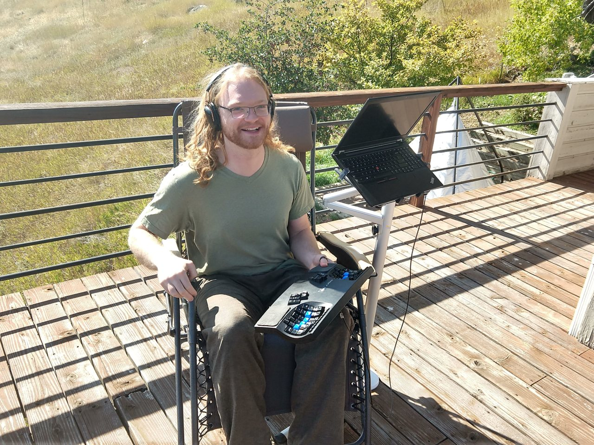
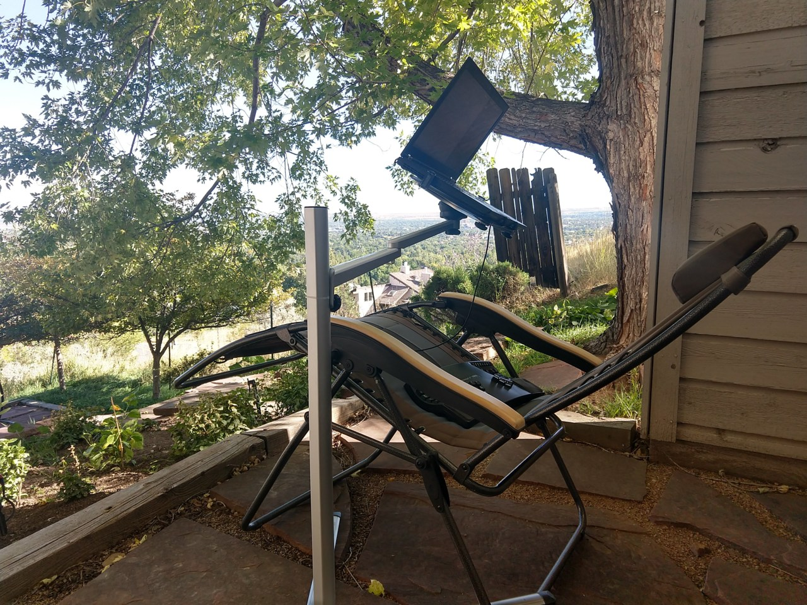

In the last couple years, I've been experimenting with some approaches
for outside computer use. For *way* too long, I'd felt compelled to
stay indoors to use the computer for any substantial chunk of
time. Happily, I've found some ways to use my computer outside which
work quite well for me, and I hope they might work well for you too!

One way to work outside is to simply take your laptop
outside. However, I find that for me using a laptop alone is not
sustainable for much more than an hour or two, and even then, it just
doesn't feel great. The laptop's screen is adjacent to the keyboard,
which means typically neither are positioned ergonomically. See the
illustration at the beginning of my [post about comfortable airplane
computing][]

[post about comfortable airplane computing]: /posts/comfortable-airplane-computing/

## Deck Desk

If you have a desk that you can work at comfortably, one
straightforward solution is to just move it outside!  Here's what
things looked like when I first moved my desk outside, in 2018:

While I'm tempted to delve into my motivations for using a [leaning
stool][], [sit-stand workstation][], and [walking treadmill][], the
focus here is on computing outside, and so will leave those details
for a future post. There is no need to have such equipment - you can
just move your desk outside or establish an auxiliary desk outside.

Some of the sections below discuss how to overcome some of the
challenges of using the computer outside.  Much of it is obvious, but
it seems good to enumerate them, as these same challenges might
dissuade people from trying outdoor computing.

[leaning stool]: https://smile.amazon.com/Focal-FKS-1000-BK-Products-Leaning-Portable/dp/B00KQ1M21I
[sit-stand workstation]: https://smile.amazon.com/Ergotron-WorkFit-S-Workstation-Worksurface-33-351-200/dp/B0076O1NCM/
[walking treadmill]: https://smile.amazon.com/iMovR-ThermoTread-Treadmill-Measures-Standing/dp/B016COFDOA

## Reclined Computing

More recently, I have been experimenting with a more minimal deck
setup, using relatively inexpensive equipment:

A photo of usage:

I've found these things to work well for this:

* A keyboard that can be comfortably used in the lap[^touch-typing]. I
  use a [Kinesis Advantage 2][] for most of my typing needs, it's by
  far my favorite keyboard (though I do have a soft spot for the
  [keyboard.io Model 01][]). I suspect that because your hands are
  fairly spread when using it, that it allows more comfortable
  postures. Due to this, I can comfortably type on the keyboard in my
  lap, with straight wrists and my upper arms at my sides.

* A "zero gravity" patio chair which can lock at particular angles.
  This allows you to set your level of recline, and overall get quite
  comfortable. I'm quite happy with my [Timber Ridge Zero Gravity
  Chair][], but I haven't really specifically compared it with
  others. While I like the wood armrests, they do have a downside,
  which is that I feel like I ought to stow it when rain is likely, in
  order to avoid damaging the wood.

* A freestanding laptop stand. Specifically I'm using a [Magichold
  stand][], which I'm quite happy with. I compared a fair number of
  options for such stands, and it looked like the most adaptable and
  appropriate one for my uses. Particularly, I was looking for
  portability, versatility, and for the ability to have the base off
  to the side.

One thing that's rather nice about the [Magichold stand][], is that
the "elbow" of the stand's arm can rotate 180°. This is rather nice
for getting it out of the way when getting in and out of the chair:

[Kinesis Advantage 2]: https://smile.amazon.com/Kinesis-Advantage2-Ergonomic-Keyboard-KB600LFQ/dp/B07K1SMRGS
[keyboard.io Model 01]: https://keyboard.io/
[Timber Ridge Zero Gravity Chair]: https://smile.amazon.com/gp/product/B017B9PPHA
[Magichold stand]: https://smile.amazon.com/gp/product/B00JWD6XC0

[^touch-typing]:
    I suppose being able to type without looking at the keyboard is
    also required to make this practical. The keyboards I suggest all
    have columnar layouts, which I think are superior for accurate
    touch typing. This way most of your fingers don't have to move
    horizontally when typing letters, and there is no ambiguity about
    which finger to use to type a particular key.

## Working with Sun: Constructed Shade

Sun can make it hard to read the screen, and it isn't great for our
skin to linger too long.

A great solution for this is shade! If your desk's position is not
naturally shaded, then various deck umbrellas should help. Since the
materials were readily at hand, I ended up using bungee cords to
attach a tarp to an umbrella stand:

This was highly adjustable and functional, though certainly not the
most picturesque solution.

## Working with Sun: Choosing Angles

Sometimes it can be quite nice to lounge in the sun, though. With a
bit of experimentation with angles, usually a comfortable
configuration can be found. If the sun isn't shining in your eyes, and
only shining on the screen obliquely, then standard computer screens
can be surprisingly readable.

In the picture above, my face is half in the sun, the chair has been
rotated past the point where the glare is bothersome. By positioning
things nearly perpendicular to the sun's azimuth, your eyes and screen
only receive sunshine obliquely.

For improved readability, the can be turned such that it receives no
direct sunshine:

## Working with Sun: Environmental Shade

For longer computing sessions, it's advisable to be in the shade. A
great way to do this is to choose a spot that's already shaded -
here's where the reclining setup usually lives:

The house and tree provide sufficient shade during most hours of the
day!

## Working with Rain

Knowing that it feels great to work outside is not always sufficient
to motivate doing it. One way to make it the default is to move your
desk outside!

Leaving it outside comes with a challenge, though, which is that
inclement weather could damage the equipment. My solution to this was
straightforward and effective - a couple tarps and bungee cords to
hold them down.

I haven't yet computed during a proper downpour - maybe one day!

## Working with Cold

This one is similarly pretty straightforward - if it's cold out,
bundle up! There is one aspect of this that might not be immediately
obvious, though: cold hands. It's uncomfortable, and sometimes even
slow to type with cold hands. A decent solution is to use gloves that
allow for dexterity, such as:

* Fingerless gloves. These can be quite practical, as they keep your
  palm and the lower parts of your fingers warm, while freeing up your
  fingertips for dexterous manipulation. I like [this pair][Fox River]
  of gloves for typing when it's cold out, but that's also the only
  pair of fingerless gloves I've ever tried. They work quite nicely,
  though the tips of my fingers do still get chilly in very cold
  weather.

  

* Gloves that are thin enough to let you feel what you are
  doing. I don't have much experience with these yet:

    - There's a pair of gloves marketed for this called ["The Writer's
    Glove"][]. Some reviews indicate that they may not be so durable,
    though, so I haven't ordered them.

    - I've just tried on a pair of thin silk liners from [Alaska
    Bear][] that have good reviews which specifically mention
    typing. They are decent gloves, I can indeed type with
    them. However, the feel isn't ideal because the seams overlap the
    fingertips, reducing the tactile sensitivity right in the spot
    where I want it[^fingertip-seams]. So for now I just use the
    fingerless gloves.

[Fox River]: https://smile.amazon.com/gp/product/B015SSNV9K
[Alaska Bear]: https://smile.amazon.com/gp/product/B00PIMIZWK
["The Writer's Glove"]: https://smile.amazon.com/Writers-Glove-Gloves-Typing-Standard/dp/B0753TYHW4

[^fingertip-seams]:
    It seems like fingertip seams are common to most glove designs,
    some reviews of ["The Writer's Glove"][] mention the same
    problem. If you find some nice thin gloves which don't have this
    problem, please let me know!

## Working with Heat

It can get a bit tough to be productive on a super hot day. This was a
bit of a challenge for me in the summer. I found one good approach was
to use simply use evaporative cooling[^cooling-vests] - douse a
t-shirt in water and then wear it!

I also set up a [mist-based patio cooling system][] on the 2018 deck
desk, and found that to be quite good for cooling the air, and
generally refreshing.

[mist-based patio cooling system]: https://smile.amazon.com/gp/product/B01A9IU0C0

[^cooling-vests]:
    There are also various commercial products,
    particularly cooling vests which use evaporative effects, phase
    change cooling, or active cooling. I never ended up picking one -
    the t-shirt method and misting system was more than sufficient for
    the hot days.

## Working without a Mouse

You might notice in the reclining pictures that I'm using an external
keyboard but no mouse. This is because via software like [vimium][],
[xmonad][], [keynav][], [gmail's keyboard shortcuts][], and my own
[todoist-shortcuts][], I mostly just use the keyboard, reaching for
the mouse infrequently. I think this can improve the flow of familiar
interactions with the computer, because they can be performed via
direct muscle memory rather than involving eye-hand coordination.

I do have a recommendation if you want to try reclined computing
with a mouse, though, which is to use a trackball mouse. I sometimes
use a [Logitech MX Ergo Trackball][], a rather nice wireless trackball
with incredible battery life - it's only needed to be recharged few
times in a couple years.

[Logitech MX Ergo Trackball]: https://smile.amazon.com/Logitech-Ergo-Wireless-Trackball-Mouse/dp/B0753P1GTS
[gmail's keyboard shortcuts]: https://support.google.com/mail/answer/6594
[keynav]: https://www.semicomplete.com/projects/keynav/
[todoist-shortcuts]: https://github.com/mgsloan/todoist-shortcuts
[vimium]: https://vimium.github.io
[xmonad]: https://xmonad.org

## Thanks for reading!

Thanks for reading this post, I hope some of you are inspired to get
outside! I realize the seasonal timing is not great for most of the
northern hemisphere. If the weather is holding you back from giving
this a shot, perhaps consider some sort of reminder to revisit in the
spring?

If you do experiment with this stuff, I'd be curious to see what you
come up with! My email address is this site's hostname at gmail.com

Also, I'm working on more posts exploring other approaches, which I
hope to publish in the next few weeks. So if you're interested in this
stuff, please check back in a while, or perhaps subscribe to my [atom
feed][].

[atom feed]: /feed.xml

[^ergonomics]:
    I am a hobbyist in ergonomics, I have no credentials related to
    ergonomics, nor have I studied much of the academic literature on
    the topic. Mostly, I've just followed my own intuition, sought
    what feels good, and avoided what causes pain. So please take my
    advice with a grain of salt, and perhaps experiment to see what
    works for you!
