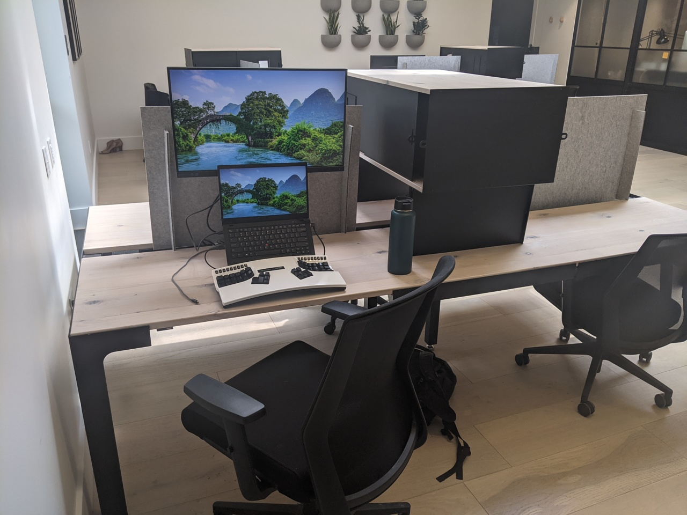
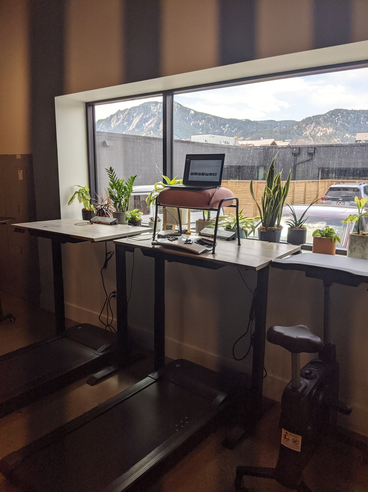
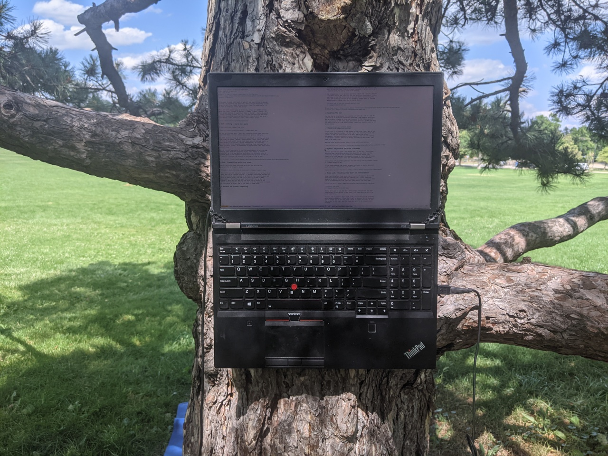
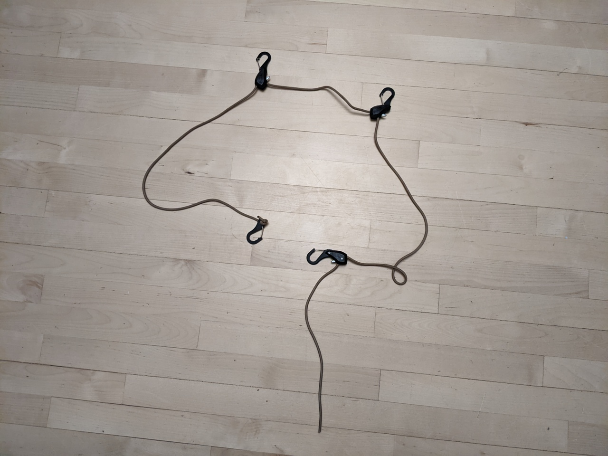

In November I moved a bit west of where I had been living in Boulder,
Colorado. My reasoning was that not a whole lot was happening in town,
so may as well live closer to nature and closer to snowboarding. It
has been a wonderful winter and spring!

Lately I've found myself wanting to spend more time in Boulder -
taking movement classes, visiting friends, etc. So, I tried out
renting a dedicated desk at a co-working space called
[kiln][]. Overall Kiln was great - nice natural light, beautiful
space, and friendly people.

[kiln]: https://kiln.co/locations/boulder

## Oof: Sitting -> more back-pain

My dedicated desk looked like this:

So, not a sit/stand desk.  There are rentable offices that have nice
sit/stand desks, however, those spaces cost quite a bit more.

So, this ended up being an accidental experiment in sitting much more
than usual for about 2 months. Unfortunately, after just a few weeks
of this, I found myself facing lower back pain in the same spot I'd
experienced it in the past, during snowboarding. It's entirely
possible that I just happened to do something funky that day, but it
seems unlikely, since I'd snowboarded a couple dozen times that season
without issue.

So, my current hypothesis is that increased amounts of sitting had
made my lower back more prone to injury. This theory is further
supported, as it's been getting much better in the month since I
stopped going to the coworking space and did not go into Boulder as
frequently (involves a fair bit of sitting in a car or bus).

[Focal Mogo]: https://smile.amazon.com/Products-Leaning-Portable-Outdoor-Available/dp/B01I2N71Z8

## Rad: Treadmilling with nice views

One of the things that convinced me to try out Kiln was the
availability of treadmill desks:

When in the space I typically used the treadmill an hour or two, which
meant most of my time was sitting.  I probably could have avoided this
by intentionally spending most of my time at the treadmill desks and
using a leaning stool like the [Focal Mogo][] to make it more
sustainable.  This probably would have worked fine, as the the
treadmill desks did not get all that much use by others in the
office. But it wouldn't work if everyone took this approach, so could
be considered an unfair use of the space in some sense.

## Getting back into outdoor computing

It occurred to me that it was ironic that I was renting co-working
space, as I so enjoy outdoor computing and would love to encourage
others to do it more.  Now that the weather is a bit warmer and the
park restrooms are open again, I've been computing in the park in
Boulder. Here is what my computer looks like while writing this post:

See my ["Tree Based Computing" post][] for more details on how this
works. The blue behind the tree is a yoga mat which I've used for a bit of
[supine computing][].

I'm very stoked with the shift to using parks / creekside areas as my
"home base" in Boulder rather than an indoor space.  It's been quite
literally a breath of fresh air.

["Tree Based Computing" post]: /posts/tree-based-computing/
[supine computing]: /posts/supine-computing/

## Side-note: new approach for around-the-tree paracord

I recently realized a small improvement to my tree setup. Previously
I'd been putting a [paracord tie-down][] around the tree, and using
carabiners to attach to it. By using the adjustable clip hooks from
three of these tie-downs, it's now all in one convenient unit:

The hooks on the ends clip together to secure it around the tree. The
other two hooks are clipped onto the [reusable "Mille-Ties"][] which
go around the hinges.

I realized that the use of "Mille-Ties" is also different from what I
describe in prior posts, where I instead used stiffer reusable
zip-ties. Since the "Mille-Ties" are softer and bendier, there is no
risk they will damage the laptop (particularly the screen). They are
also generally less obtrusive to leave on the laptop.

[paracord tie-down]: https://smile.amazon.com/gp/product/B01COUOCG6
[reusable "Mille-Ties"]: https://smile.amazon.com/gp/product/B00ARUQBRY
